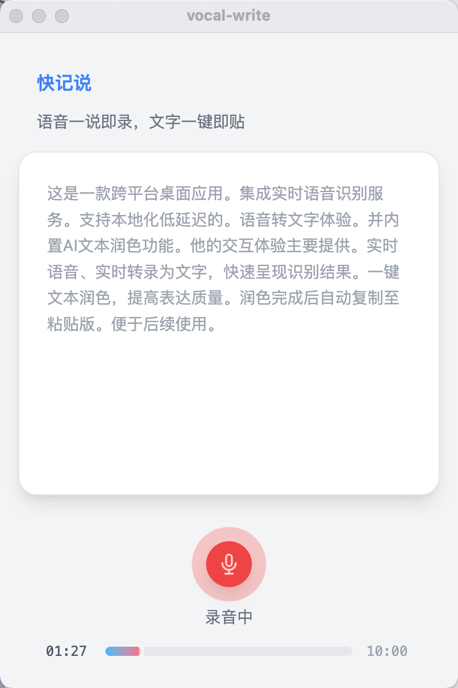

# 声笔 - 语音实时转写桌面应用

声笔 是一款基于 Next.js 与 Electron 的跨平台桌面应用，集成实时语音识别服务，支持本地化、低延迟的语音转文字体验，并内置 AI 文本润色功能。

## 核心特性

- **实时语音识别**：WebSocket 直连外部的实时语音识别的ASR接口。
- **AI 文本润色**：调用大模型自动优化识别文本，纠错、精简、提升表达。
- **可视化配置**：提供友好的配置页面，方便用户管理API密钥信息。
- **组件化开发**：前端功能与 UI 拆分为独立 React 组件，便于维护和扩展。
- **隐私安全**：API 密钥仅存储于本地后端，前端通过签名授权调用，保障数据安全。
- **跨平台支持**：Electron 打包，兼容 macOS、Windows、Linux。

## 技术栈

- **主框架**：Next.js ^14.2.3、Electron ^31.0.0
- **前端**：React ^18.2.0、Tailwind CSS ^3.4.3
- **语音服务**：腾讯云实时语音识别（ASR）
- **AI 服务**：硅基流动提供的大模型（LLM）
- **音频处理**：Web Audio API (AudioWorklet)
- **代码规范**：ESLint、Prettier

## 目录结构

```
├── src/
│   ├── components/       # React 组件（feature/、layout/、ui/）
│   ├── main/             # Electron 主进程
│   └── utils/            # 前端工具函数
├── lib/                  # 服务与工具模块（api.js、asr-service.js、llm-service.js、utils.js）
├── hooks/                # 自定义 React Hooks
├── pages/                # Next.js 页面及 API 路由（如 polish-text.js）
├── public/               # 静态资源
├── styles/               # 全局样式
└── ...                   # 配置与脚本
```

## 主要功能模块

### 1. 语音识别

- 通过 `lib/asr-service.js` 封装腾讯云 ASR，支持实时音频流识别。
- `hooks/useAsr.js` 提供 React Hook，便于组件调用和状态管理。
- 识别结果实时展示于 `RecognitionResult` 组件。

### 2. 文本润色（AI 优化）

- 前端通过 `lib/llm-service.js` 的 `polishText(text)` 方法发起文本润色请求。
- 后端 `pages/api/polish-text.js` 路由调用大模型，根据定制提示词优化文本。
- 润色结果与原始识别文本可对比展示，提升可读性和专业度。

### 3. 配置管理

- 提供可视化配置页面 `/config`，用户可以方便地管理API密钥。
- 支持腾讯云语音识别配置（APP_ID、SECRET_ID、SECRET_KEY）。
- 支持大模型API密钥配置（LLM_API_KEY）。
- 配置信息安全存储在本地 `.env.local` 文件中。
- 主页面右上角设置按钮可快速访问配置页面。

### 4. 交互体验

- 语音实时转录为文字，快速呈现识别结果。
- 一键文本润色，提升表达质量。
- 润色完成后自动复制至剪贴板，便于后续使用。

## 界面展示



- 实时语音识别结果展示。

## 快速开始

1. **克隆项目**
   ```bash
   git clone https://github.com/your-username/vocal-write.git
   cd vocal-write
   ```
2. **安装依赖**
   ```bash
   npm install
   # 或
   yarn install
   ```
3. **配置API信息**

   **方式一：通过配置页面（推荐）**
   - 启动应用后，点击主页面右上角的设置按钮
   - 在配置页面填写腾讯云和大模型的API信息
   - 点击保存配置即可

   **方式二：手动创建配置文件**
   在根目录创建 `.env.local`，填写API信息：

   ```
   TENCENT_APP_ID=xxx
   TENCENT_SECRET_ID=xxx
   TENCENT_SECRET_KEY=xxx
   LLM_API_KEY=xxx
   ```

   > `.env.local` 已加入 `.gitignore`，请勿上传密钥。

4. **启动开发环境**
   ```bash
   npm run dev
   # 或
   yarn dev
   ```
   访问 [http://localhost:3000](http://localhost:3000)

## 代码规范

- 提交前建议执行 `npm run format` 保持代码风格统一。
- 采用模块化开发，便于维护和扩展。

## 贡献与反馈

欢迎提交 Issue 或 PR 参与改进。建议与问题请在 GitHub 讨论区反馈。

---

> 本项目仅用于学习与交流，涉及的 API 密钥请妥善保管，避免泄露。
